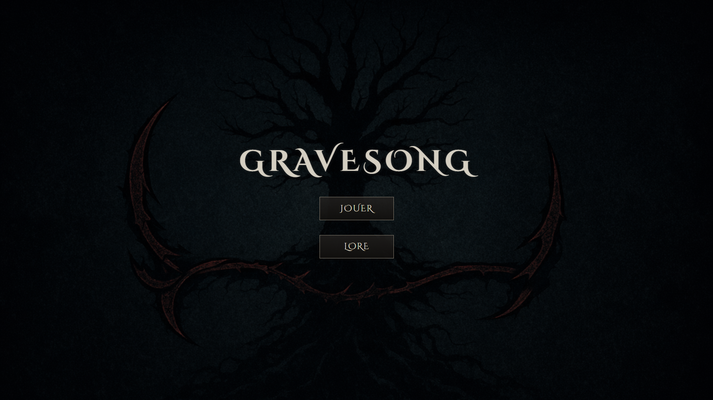
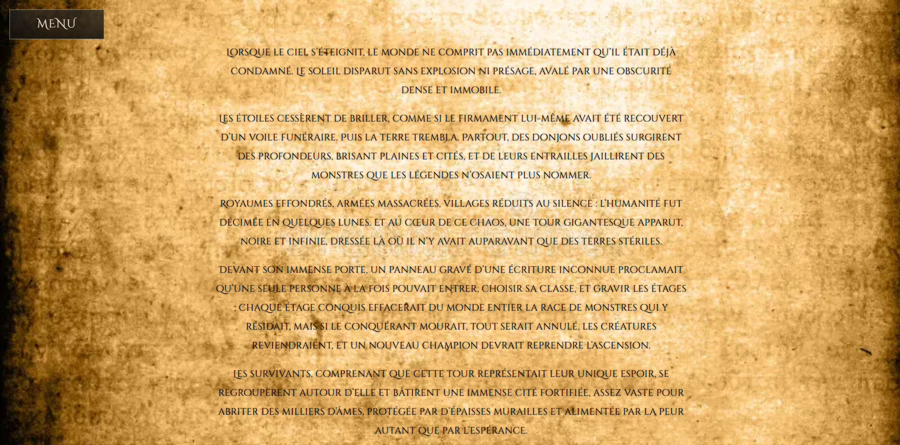
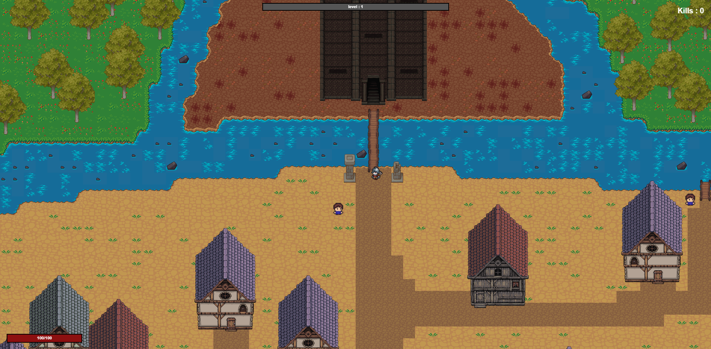
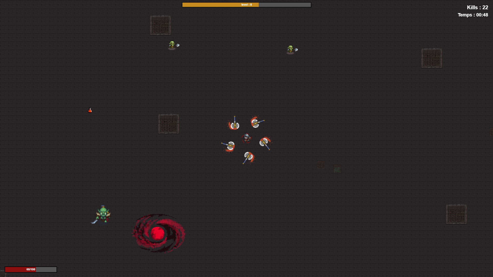
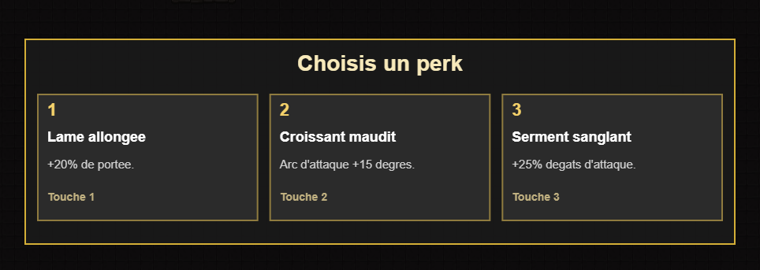
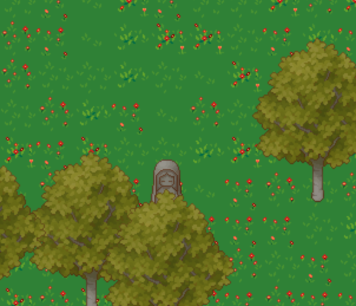
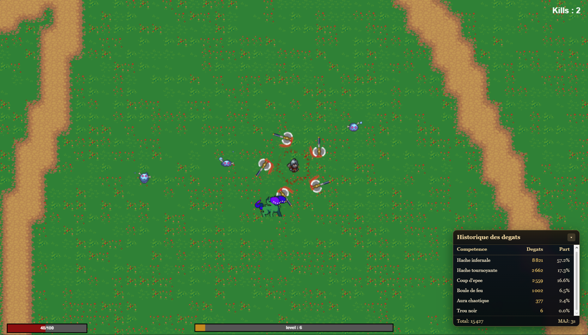

# GraveSong
Jeu d'action-aventure en JavaScript avec interface web immersive.

## Aperçu
GraveSong est un petit jeu web en 2D où le joueur explore des zones, affronte des ennemis et monte en niveau.

### Captures d'écran

## Fonctionnalités
- Moteur de jeu en JavaScript pur
- Navigation par clic et touches clavier
- Musique de fond avec reprise automatique
- Système de niveaux et statistiques de dégâts
- Écrans de lore, menu, et plein écran (F11)
- Gestion des ennemis et combats avec boss
- Jouable avec ZQSD ou flèche directionelle et clikable (seulement pour les perks du perso)

## Installation et Prérequis
1. Cloner ou télécharger le dépôt.
2. Ouvrir le dossier du projet dans un navigateur moderne.
3. Pour un test local plus fiable, lancer un serveur HTTP sur le dossier racine.

Prérequis recommandés :
- Navigateur moderne (Chrome, Firefox, Edge)
- Serveur local simple (Python `http.server`, Live Server VS Code, etc.)

## Utilisation
1. Ouvrir `index.html` depuis le dossier racine.
2. Appuyer sur n'importe quelle touche ou cliquer pour démarrer.
3. Sur l'écran d'accueil, appuyer sur `F11` pour passer en plein écran si besoin.
4. Cliquer pour charger la page de jeu et commencer l'aventure.

## Configuration
Aucune variable d'environnement n'est requise pour ce projet.

Si vous utilisez un serveur local, configurez simplement la racine du projet comme dossier de service.

## Structure du Projet
- `index.html` : page d'accueil du jeu
- `README.md` : documentation du projet
- `script.js` : logique d'audio et navigation initiale
- `css/` : styles du jeu
- `js/` : code JavaScript du jeu
- `assets/` : images, audio, sprites
- `template/` : pages intermédiaires de chargement et lore
© 2026 Gury Antoine, Gonzaga Clément, Beyney Thomas, Chochon Elsa
